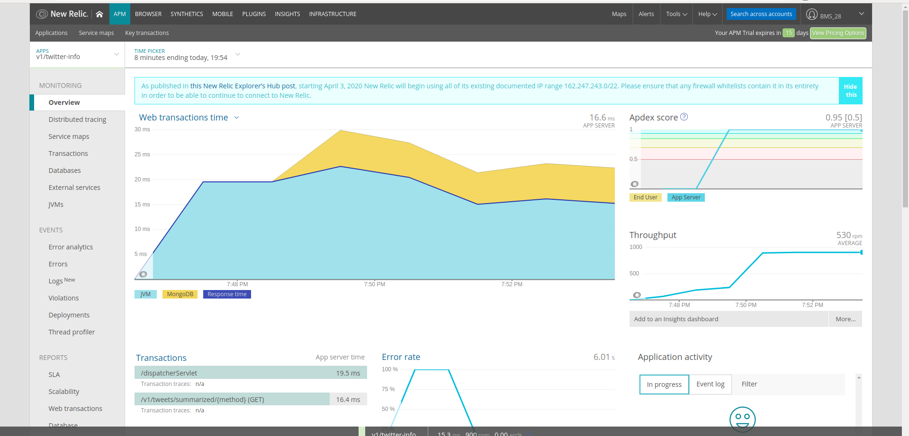
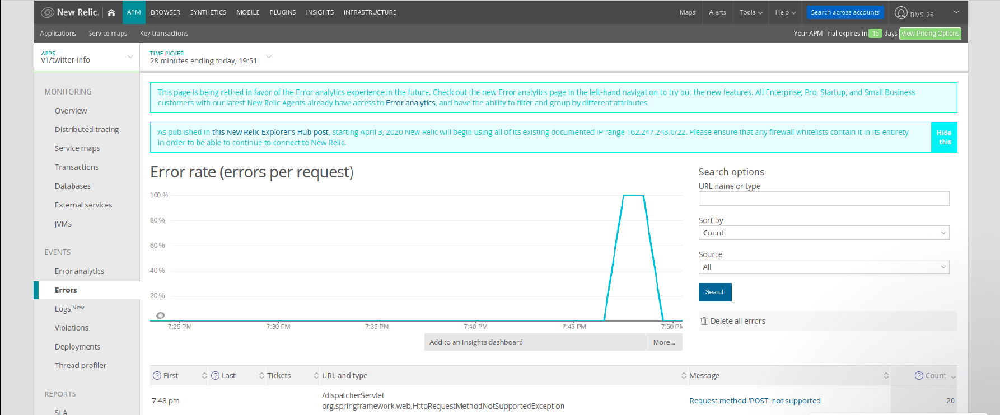
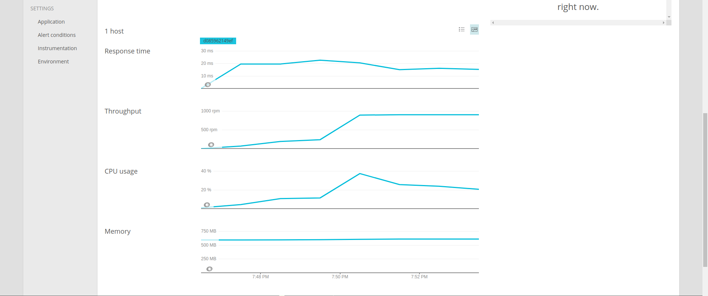
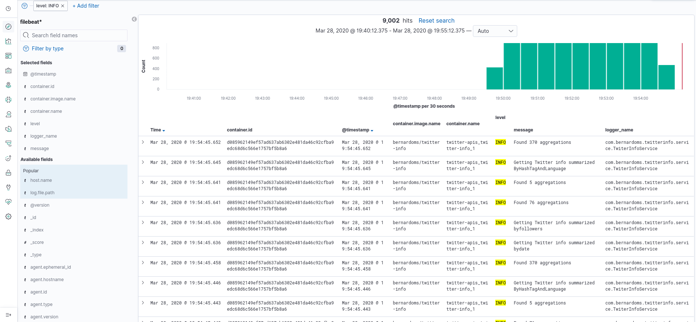
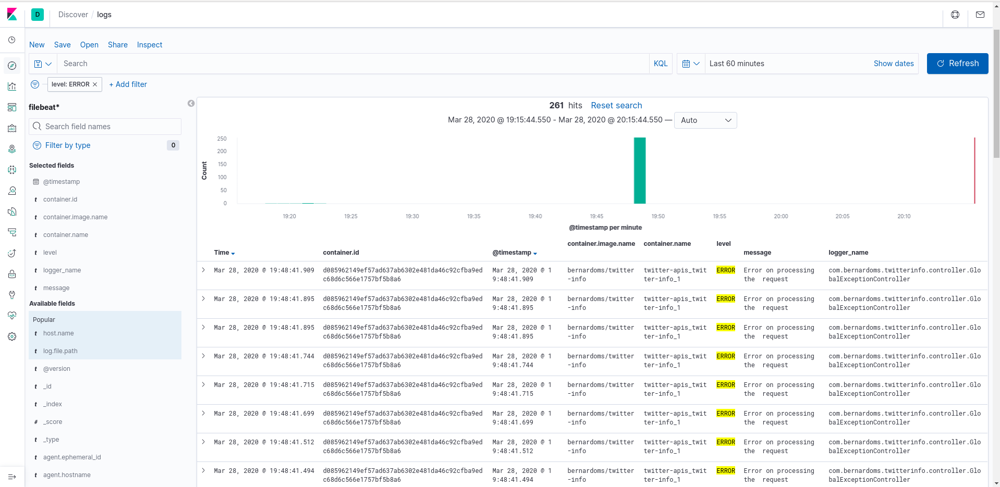
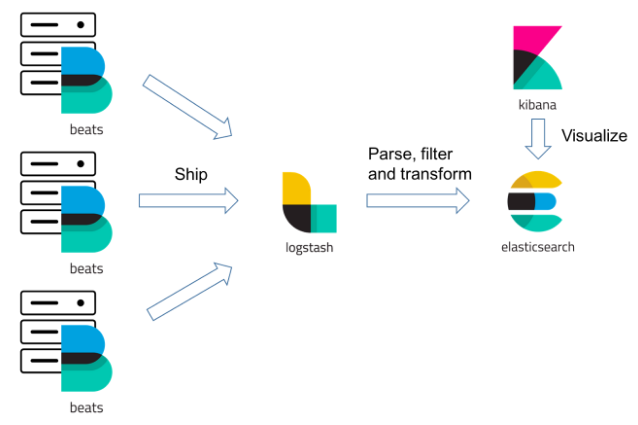

# Twitter-services

## Dashboard

Using new relic in the app is possible to see a vision like the picture with the response time of the api, and the apdex(measure of the satisfaction from a configured response time).
It's possible to see the error rate and the throughput measured in RPM(request per minutes).

With new relic is possible to see a detailed vision of error rate and the log to understand more about the error.

Its also possible to see check info about how many instancies are running and how many resources are used.

##Logs 

In the twitter services apis is also possible to see the logs of the apis using Kibana. In this picture there is a picture
of a filter showing only logs with level info.

In this picture the filter is with log level error.

Log architecture used on this project. 

Filebeat gets the logs from the docker(only the containers with a specific label) 
and send to logstash. Logstash will filter and transform then and send to elasticsearch. Once logs are on elasticsearch its possible
to filter then using Kibana.

